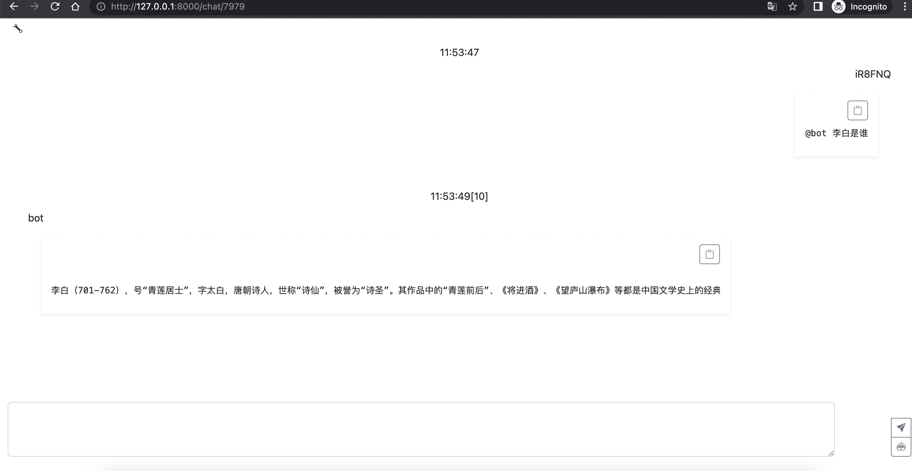

# 聊天室+openai (chat room with openAi)


### 下载release (download release)
```
# 解压后
./mac_cahtboot -conf=config.yaml
# open http://127.0.0.1:8000/
```

### 自己编译 (build by yourself)
```
make pack
cp configs/config.yaml.example bin/config.yaml 
./bin/mac_chatbot   -conf=bin/config.yaml 
# open http://127.0.0.1:8000/
```

# 配置config.yaml 文件
data.openai.token 项 替换成openAi的key就行
data.openai.proxy 项 可以贴上http代理地址


### api key

https://openai.com/api/